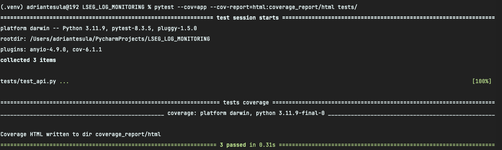
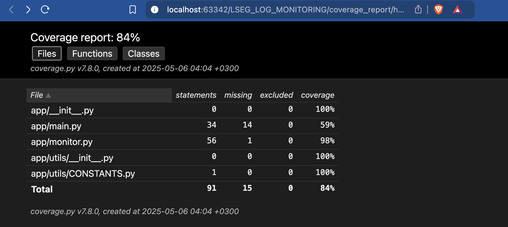

# LSEG_LOG_MONITORING
This is a Coding Challenge.

This application is able to:
1. Parse the CSV log file.
2. Identify each job or task and track its start and finish times.
3. Calculate the duration of each job from the time it started to the time it finished
4. Produce a report or output that:
   * Logs a warning if a job took longer than 5 minutes
   * Logs an error if a job took longer than 10 minutes

## Frameworks / tools used for Coding Challenge.
1. Github
2. Github Actions
3. Docker
4. FastApi
5. Docker hub

## Prerequisites
    - python 3.11.9
    - Web Browser

## IDEE used:
    - PyCharm

## How to run project locally:
1. Open PyCharm
2. Install requirements.txt
    ```
        pip install -r requirements.txt
    ```
3. Run using uvicorn
   ```
       uvicorn app.main:app --reload --host 0.0.0.0 --port 8000
   ```
4. Use the following link to interact with docs
   ```
      http://0.0.0.0:8000/docs
   ```
5. Run the locally test using pytest
   ```
      pytest --cov=app --cov-report=html:coverage_report/html tests/ 
   ```
   
## How to run project using docker:
0. Install docker
1. Build the image locally
   ```
      docker build -t LOG_MONITORING .
   ```
2. Run the docker image created
   ```
      docker run -p 8000:8000 LOG_MONITORING
   ```

## How to run directly using docker hub
0. Install docker
1. Run docker directly 
   ```
      docker run -p 8000:8000 adrian97gl/lseg-log-monitor
   ```
2. Use the following link to interact with docs
   ```
      http://0.0.0.0:8000/docs
   ```

## How to interact with docs
1. Run the application
2. Enter on the following link to interact with docs
   ```
      http://0.0.0.0:8000/docs
   ```
3. Press on /log-interpretation/ -> Then Try it out -> Choose file -> Add .log file -> Execute.

4. Then response body will appear.

5. To view every log, go on the next section Observability.
6. Press /observability -> Then "Try it out" -> Execute -> And in response body everything log is available.

7. To view everything directly on web you can go directly to:
```
   http://0.0.0.0:8000/observability
```


## Usage of testing framework

For the testing I used pytest because it's very native with python and it's easy to be used.

1. Run the project
2. Execute pytest script in the root folder with the command: 
   ```
      pytest --cov=app --cov-report=html:coverage_report/html tests/
   ```
3. This command will run all the tests that are available in the folder ```tests```
4. After are the tests are finished the result of them is shown in terminal and index.html related to coverage is present in coverage_report.
5. 
6. 